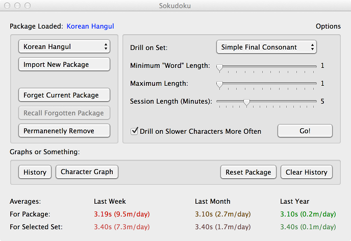

# 速読 Sokudoku

## What Is It?

Sokudoku is a program for practicing reading random characters.
Although probably best for syllable-based character sets like Japanese
Katakana or Hiragana, or Korean Hangul, it probably would work fine
with "regular" phonetic character sets as well (or something like
Korean Jomo), taking into account the fact that it more or less
produces strings of random gibberish.  Things like Japanese or Chinese
compound words would work as well, although those are probably more
suited for a general flashcard test program like
[Anki](http://ankisrs.net/).

The program itself is fairly simple: it displays a set of characters,
the user attempts to type in the pronunciation of those characters as
quickly as possible, it times the user (with a penalty for incorrect
answers), keeps track of how fast the characters were entered and
optionally preferentially feeds the user characters they have trouble
with.

## Usage

The first time the program is run, it will prompt you to load a
package into Sokudoku's library.  This step is not optional -- the
program will not run until at least one package is loaded.  From
there, the user is presented with the main window:

Everything else launches from there.  Drill options can be chosen on
the right.  Subsets from a package can be selected (e.g., for the
Japanese Kana package, drills can be limited to Hiragana or Katakana).
Session length can be chosen, minimum and maximum lengths for drill
questions can be selected, and whether or not difficult characters
should be prioritized can be toggled off and on (i.e., the user can
choose whether slower characters should appear more often in drills).

On the left are some other options: the top button chooses which
package is currently loaded.  Below that, more packages can be loaded,
a package can be "forgotten" (i.e., taken out of the list of packages
available to select), "recalled" (i.e., restored to the list of
packages available with all of its history intact) or permanently
deleted (which will remove all of its history as well.  Once that
occurs, it can only be restored -- minus any history or character
weightings -- by being re-imported).

On the bottom are other options for erasing history (this removes any
data used by the history graphs) or completely resetting the package
(restoring it to the state it was in when freshly imported, losing any
character weightings and history).  The other two buttons load graphs.

If the history button is selected, you get the following window (which
allows the user to see various graphs of recorded drill result
statistics):

If the character graph button is selected, you get the following
window (which allows the user to see the average drill time for the
characters in the package, including ten-second penalties for
incorrect answers):

Starting a drill is done by pressing "Go!" -- as should be fairly
obvious -- and produces the following window.  To respond to each
set of characters, type the pronunciation into the box (which should
start selected, and clears itself after each question).

## Packages

This repository contains several package files that can be drilled on
in the main program.

- Packages/ : package files
- Packages/Source/ : ruby programs that generate those package files

So far a Japanese kana and Korean Hangul and Jomo packages are included;
more may follow.

Packages are encoded as plists (Apple's XML format that Cocoa supports
natively).  The format is actually fairly simple: a dictionary with a
name, an array of tags, an array of descriptions, and an array of
characters (each made up of a dictionary containing a literal, tags,
and pronunciations).  It's unlikely I'll fully document the format
anytime soon, but there are several examples in the repository of both
programs that will generate packages and packages themselves.

Once packages are loaded, the application handles storing the package
and history internally in the user's account.

## XCode Project

This repository contains an XCode project in the following
directories; if you have XCode installed, it should be possible to
load the project from the checked out repository and then build or
modify it.

- Sokudoku/ : source files
- SokudokuTests/ : unit tests
- Sokudoku.xcodeproj/ : XCode project files

## License

I'll Apache-fy this at some point, but at the moment I'm just getting
it started and it's too much trouble.  So Copyright 2013 Douglas
Triggs (douglas@triggs.org) and all that.
